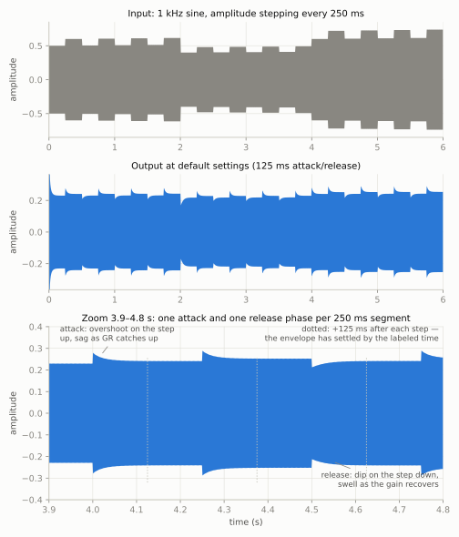
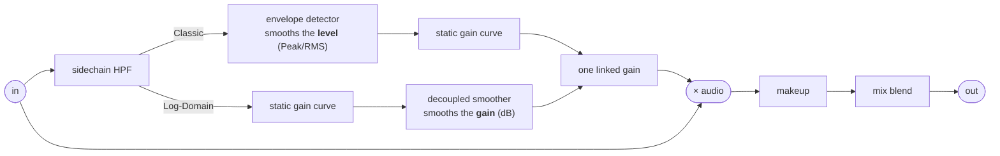
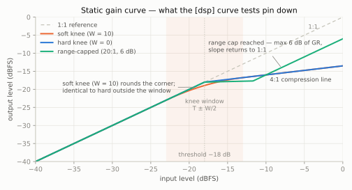
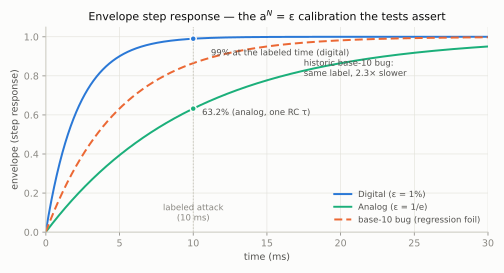
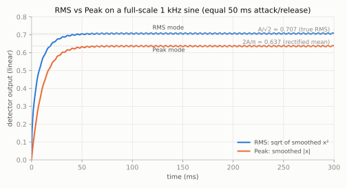
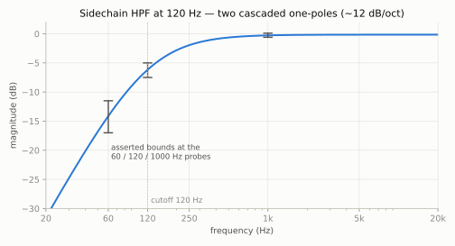
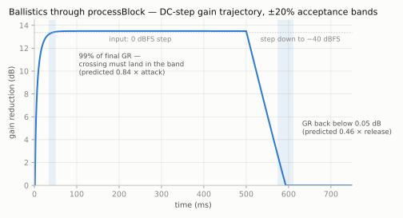

# Compressor

A dynamic range compressor audio plugin (AU / VST3 / Standalone) built with [JUCE](https://juce.com) and CMake. The DSP is a feed-forward compressor with stereo-linked true-RMS envelope detection and the Giannoulis/Massberg/Reiss quadratic soft knee. The topology descends from Will Pirkle's *Designing Audio Effect Plugins in C++*; the headers in `plugin/include/` document the theory (one-pole coefficient derivation, dB conventions, knee math) inline.

## Parameters

| Parameter   | Range / Choices        | Default |
|-------------|------------------------|---------|
| Threshold   | -60 … 0 dB             | -18 dB  |
| Ratio       | 1:1 … 20:1             | 4:1     |
| Attack      | 0.1 … 1000 ms          | 125 ms  |
| Release     | 10 … 5000 ms           | 125 ms  |
| Knee Width  | 0 … 10 dB              | 1 dB    |
| Makeup Gain | -12 … +12 dB           | 0 dB    |
| Topology    | Classic / Log-Domain   | Classic |
| Detector    | Peak / RMS             | RMS     |
| Sidechain HPF | Off / 60 / 120 / 250 Hz | Off  |
| Mix         | 0 … 100 % wet          | 100 %   |
| Range       | 0 … 40 dB max GR       | 40 dB   |
| Bypass      | on / off               | off     |

**Topology** selects where the ballistics live: *Classic* smooths the signal level before the gain computer (the traditional Pirkle/analog-RMS arrangement); *Log-Domain* computes gain instantly and smooths the gain-reduction signal in dB afterwards (the Giannoulis/Massberg/Reiss recommended design). **Detector** (Peak/RMS) applies to Classic topology only — Log-Domain senses level instantaneously by design. **Sidechain HPF** filters the detection path only (the audio is never filtered), so bass stops *deciding* the gain while still receiving it — the fix for kick-driven pumping. **Mix** blends the compressed path against the dry input for parallel (New York) compression. **Range** caps the maximum gain reduction, letting aggressive threshold/ratio settings stay transparent. The editor also provides factory presets and stereo input/GR/output metering; gain reduction is shown as a single bar because detection is stereo-linked (both channels always receive identical gain). Attack, Release and Ratio knobs use logarithmic-feel skews so the musically useful ranges occupy most of the rotation.

## Listening tests

Useful A/B material for hearing what the design choices do:

- **Classic vs Log-Domain on a drum bus** — same settings, flip Topology. Listen to the releases: Classic's get audibly "heavier" the deeper it compresses (an exponential release in the linear domain is not exponential in dB), which is exactly the artifact the log-domain design removes. Expect Log-Domain to sound more even at any depth of compression.
- **Peak vs RMS on a vocal** (Classic topology) — RMS tracks energy, so it should feel forgiving and musical; Peak follows instantaneous excursions and grabs consonants harder.
- **The Limiter preset on something spiky** — 20:1 at 0.5 ms attack with a near-hard knee is the stress-test corner of the design; listen for distortion or instability on sharp transients.
- **Stereo image stability** — pan something percussive hard left over a sustained pad and watch/listen: because detection is linked, the image should hold still under compression instead of lurching toward the quieter side.
- **Knee width automation** — sweep Knee from 0 to 10 dB on material hovering around threshold; a wide knee makes the compressor's engagement essentially inaudible, a hard knee makes it a deliberate effect.
- **Sidechain HPF on a full mix** — compress a mix with a prominent kick, then flip the HPF from Off to 120 Hz: the whole-mix "pumping" on each kick hit should largely disappear while the bass itself still gets compressed along with everything else.
- **Parallel compression on drums** — Drum Punch preset (or any heavy setting) with Mix around 50–70%: the crushed copy adds density and sustain underneath while the dry path keeps the transients. Compare against 100% wet at a gentler setting — parallel usually sounds bigger *and* punchier.
- **Range for transparent leveling** — on a dynamic vocal, set an aggressive low threshold with Range at 40 dB and listen to it slam; then wind Range down to 4–6 dB: consistency without the clamp.

## Requirements

- CMake 3.22+
- A C++20 toolchain (Xcode command-line tools on macOS, MSVC on Windows)

No manual dependency installation is needed: the first CMake configure downloads CPM.cmake, JUCE 8.0.14 and Catch2 3.4.0 into `libs/`.

## Build

```sh
cmake -B build -DCMAKE_BUILD_TYPE=Release
cmake --build build
```

The first configure downloads JUCE and Catch2, and the first build compiles the JUCE modules, so expect it to take several minutes; subsequent builds are incremental.

Built plugins land in `build/plugin/CompressorPlugin_artefacts/Release/` (`AU/`, `VST3/`, `Standalone/`). Because `COPY_PLUGIN_AFTER_BUILD` is enabled, on macOS the AU and VST3 are also copied into `~/Library/Audio/Plug-Ins/` so a DAW can pick them up straight away.

To work in Xcode instead, generate an Xcode project (then build from the IDE or the command line):

```sh
cmake -G Xcode -B build
cmake --build build --config Release
```

## Test

Tests are written with Catch2 and registered with CTest. After building:

```sh
ctest --test-dir build --output-on-failure
```

Useful variants:

```sh
ctest --test-dir build -N                          # list tests without running
ctest --test-dir build -R "Compression Result" -V  # run one test by name, verbose
```

The `Compression Result` test runs the sine sweep in `samples/sin_1000_vary.wav` through the processor block-by-block and compares the output sample-for-sample against the golden reference `samples/processed_buffer`, so it will fail if the compression algorithm's output changes. After an intentional DSP change, regenerate the reference and confirm a plain run passes:

```sh
COMPRESSOR_REGEN_GOLDEN=1 ctest --test-dir build -R "Compression Result"
ctest --test-dir build
```

The golden input is a 1 kHz sine whose amplitude steps every 250 ms, and it is processed at
the defaults: 125 ms attack/release, which in the digital convention (99% settled in the
labeled time) means each 250 ms segment contains exactly one complete ballistic phase. The
output waveform makes the ballistics visible: on every step up the output overshoots, then
sags as the gain reduction catches up (attack); on every step down it dips, then swells back
as the gain recovers (release). The shape of each curve is the one-pole math at work: the
detector smooths the signal's *power*, whose remaining error after a step decays as
`0.01^(t/125ms)`, and the crest you see is that estimate pushed through the static gain
curve. Because the error decay reaches 1% at exactly the labeled time, every curve has gone
flat by 125 ms after its step — the dotted markers in the zoomed panel — which is the
attack/release calibration made visible on the waveform.



### What the automated tests verify

Beyond the golden file, the suite tests the DSP against its own documented math, in three
tagged layers (run a subset straight from the binary: `build/test/CompressorTest "[dsp]"`):

- **`[dsp]`** — the pure C++ units (`Compressor`, `EnvelopeDetector`, `SidechainFilter`,
  `DecoupledSmoother`) in isolation, in `test/source/DspUnitTests.cpp`.
- **`[processor]`** — behavior through `processBlock`, in `test/source/ProcessorTests.cpp`.
- **`[robustness]`** — invariance and safety checks, same file.

Where each layer probes the signal path (Giannoulis et al. Fig. 7a vs 7c):



The figures below are generated from the same recurrences by `docs/generate_figures.py`
(needs `matplotlib`; re-run it if the DSP math changes).

#### Static gain curve

The gain computer is a pure function of level (dB in → gain dB out): unity below the knee,
`(1/R − 1)·(level − T)` above it (floored at −Range), and inside `T ± W/2` the quadratic
`(1/R − 1)·(level − T + W/2)² / 2W` — the unique parabola matching the outer segments in
both value and first derivative, so the effective ratio glides from 1:1 to R with no corner.
The tests evaluate `computeGainDb` at analytic points (knee midpoint = `slope·W/8`, both
edges, the range cap), numerically differentiate across the knee, and sweep the whole range
for continuity and monotonicity.



#### Envelope ballistics

The one-pole smoother `y[n] = a·y[n−1] + (1−a)·x[n]` has step-response error `a^n`, so
"attack time" means `a^N = ε`: ε = 1% (Digital) or 1/e (Analog). The tests drive a unit
step and assert the envelope sits at exactly 0.99 / 0.632 after the labeled time, at both
44.1 and 96 kHz — the regression guard for the historic base-10-log bug that made every
time constant 2.3× slower than labeled (the dashed curve). The `DecoupledSmoother` gets the
same treatment: 99% rise in the attack time, decay landing just past the labeled release
(the documented cascade interaction).



#### RMS vs Peak detection

RMS smooths x² and takes the root *after* averaging; Peak smooths |x|. With equal attack
and release the branching smoother is a plain lowpass, so on a steady sine the two modes
must settle at provably different values: A/√2 (true RMS) vs 2A/π (rectified mean). The
test asserts both — and that they differ, because the historic sqrt-before-smoothing bug
made RMS mode literally identical to Peak. A second test pins the documented ~1.6 dB
crest-riding bias of fast-attack RMS (5/50 ms).



#### Sidechain high-pass

Two cascaded one-pole high-passes (`k = 1 − e^(−2πfc/fs)`): expect ≈6 dB down at the
corner, steepening toward 12 dB/oct below, transparent well above, and a bit-exact bypass
at 0 Hz (asserted sample-for-sample). The response test plays steady probe tones at 60,
120 and 1000 Hz through the 120 Hz filter and asserts the measured attenuation lands in
the marked windows.



#### Through processBlock

- **Steady state follows the static curve.** For a −6 dBFS sine the detected level is
  known per mode (A/√2 for RMS, 2A/π for Peak, the crest-riding peak level for
  Log-Domain), so the output RMS must equal input + `slope·(detected − T)` within
  0.75–1 dB. This is the first test coverage the Log-Domain topology has had.
- **Ballistics timing.** A DC step makes the applied gain recoverable exactly per sample
  (`out/in`), so the gain-reduction trajectory can be checked against closed-form predicted
  crossings (99%-of-final GR ≈ 0.84 × attack; GR extinguished ≈ 0.46 × release) with ±20%
  acceptance bands — wide enough for float noise, far too tight for a 2.3×-class bug.
- **Stereo link.** A loud left / quiet right signal must see identical attenuation on both
  channels (±0.1 dB) — the quiet side ducked >5 dB purely by the loud side.
- **Mix / bypass / makeup identities.** Mix 0% returns the dry input; mix 50% equals
  `0.5·wet + 0.5·dry` exactly; bypass is a bit-exact passthrough; at ratio 1:1 the whole
  plugin reduces to the makeup gain.



#### Robustness

Attack timing measured in ms must agree across 44.1/48/96 kHz (±10%); output must be
identical (≤1e-6) for block sizes 32/441/4096; silence in → exact zeros out, including
after a loud passage (the subnormal flush); a +12 dBFS input stays finite and bounded in
both topologies; and a full save/recall round-trip restores all twelve parameters.

## CI

`.github/workflows/dev_ci.yml` builds Release on Windows and macOS on every push to `main` and uploads zipped plugin artefacts. Pushing a `v*` tag creates a GitHub release with the platform zips attached.

## References

- Will Pirkle — *Designing Audio Effect Plugins in C++*
- D. Giannoulis, M. Massberg, J. D. Reiss — [*Digital Dynamic Range Compressor Design — A Tutorial and Analysis*](https://www.eecs.qmul.ac.uk/~josh/documents/2012/GiannoulisMassbergReiss-dynamicrangecompression-JAES2012.pdf), JAES 60(6), 2012
- [JUCE CMake API](https://github.com/juce-framework/JUCE/blob/master/docs/CMake%20API.md)
- [Unit testing JUCE audio processors with Catch2](https://ejaaskel.dev/unit-testing-audio-processors-with-juce-catch2/)
- [CMake for JUCE (video)](https://www.youtube.com/watch?v=4i-m7m1miFw), [JUCE testing (video)](https://www.youtube.com/watch?v=8kF0Ea2VuXA)
- [vscode-cmake-tools debug & launch](https://github.com/microsoft/vscode-cmake-tools/blob/main/docs/debug-launch.md)
